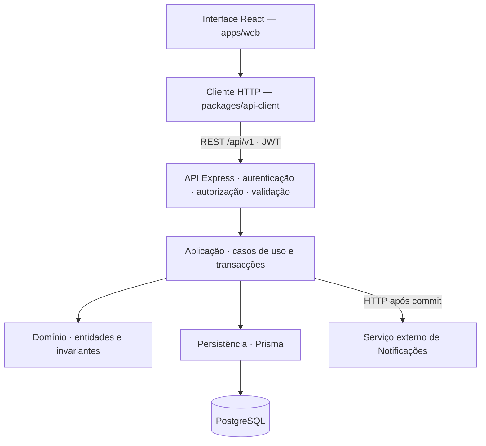

# Smart Campus — Gestão Financeira de Estudantes

Módulo de gestão financeira do Smart Campus da Universidade Joaquim Alberto Chissano (UJAC). Centraliza dívidas, pagamentos e contestações dos estudantes e disponibiliza a situação financeira para integração com os serviços académicos.

[Contratos de integração](docs/contratos-financial.md) · [Especificação funcional](docs/especificacao-modulo-gestao-financeira.md) · [Modelo de dados](docs/exercicio-1/diagrama-financeiro.svg) · [Execução local](#execução-local)

## O que o módulo faz

- **Dívidas:** registo e consulta de cobranças associadas ao estudante e à sua origem.
- **Pagamentos:** confirmação pela tesouraria, com actualização dos registos financeiros.
- **Situação financeira:** consulta do estado de regularidade, histórico e dívidas vencidas.
- **Contestações:** submissão pelo estudante e resolução pela equipa financeira.
- **Gestão:** relatórios financeiros, configuração de políticas e auditoria das operações.
- **Avisos:** registo de notificações financeiras e envio ao serviço externo, com acompanhamento e novas tentativas.

O estudante consulta os seus dados e contesta as suas dívidas. Os perfis `FINANCE` e `ADMIN` registam dívidas, confirmam pagamentos e resolvem contestações; a gestão de políticas é reservada a `ADMIN`.

## Modelo de dados

A identidade do estudante pertence ao Core. O Financeiro associa os seus registos a `User.id`: o campo financeiro `studentId` representa esse identificador, **não o número de matrícula**.

| Entidade | Responsabilidade |
|---|---|
| `Debt` | Cobrança do estudante, com valor, origem, vencimento e estado |
| `Payment` | Pagamento associado a uma dívida e ao utilizador que o confirmou |
| `FinancialStatus` | Registo da situação financeira do estudante |
| `AnalysisRequest` | Contestação de uma dívida e respectiva decisão |
| `FinancialNotification` | Aviso financeiro e acompanhamento da entrega externa |
| `FinancialPolicy` | Parâmetros da política financeira |
| `AuditEvent` | Rastreabilidade das operações e dos seus responsáveis |

Um estudante pode ter várias dívidas; cada dívida pode ter pagamentos e pedidos de análise. O registo `FinancialStatus` é único por estudante. As relações locais são definidas no [schema Prisma](apps/api/prisma/schema.prisma). A referência `externalNotificationId` liga logicamente o aviso ao serviço externo de Notificações, sem chave estrangeira entre bases de dados.

Consulte o [diagrama de entidades](docs/exercicio-1/diagrama-financeiro.svg), a [definição DBML](docs/exercicio-1/diagrama-financeiro.dbml) e os [atributos e relações](docs/exercicio-1/atributos-e-relacoes.md) para os detalhes do modelo.

## Contratos e integração

O [catálogo de contratos](docs/contratos-financial.md) é a referência central para endpoints, dados, autenticação, permissões, regras de negócio e tratamento de falhas.

| Contrato | Módulos envolvidos | Finalidade | Estado |
|---|---|---|---|
| C1 — Identidade académica | Estudantes e Docentes → Financeiro / Avaliações | Consultar a identidade académica ligada ao utilizador do Core | Proposto |
| C2 — Regularidade financeira | Financeiro → consumidores autorizados | Consultar a situação financeira para decisões de acesso académico | Consulta actual implementada; contrato específico entre módulos proposto |
| C3 — Avaliações e cobranças | Avaliações ↔ Financeiro | Associar taxas às inscrições e consultar a sua liquidação | Proposto |
| C4 — Sessões e participantes | Horários / Avaliações / Financeiro | Relacionar a avaliação com a sessão e os participantes | Proposto |
| C5 — Notificações | Financeiro → Notificações | Enviar avisos e acompanhar a aceitação pelo receptor | Emissor implementado; receptor externo por validar |

Na regra de integração definida para Avaliações, `ACTIVE` permite consultar notas e `BLOCKED` impede essa consulta. A aplicação dessa regra pertence a Avaliações e permanece pendente de implementação conjunta. Regularidade financeira e pagamento de uma taxa específica são verificações distintas.

### API disponível

Base: `/api/v1/financial`. As rotas exigem `Authorization: Bearer <token>` obtido no Core, através de `POST /api/v1/auth/login`.

| Recurso | Operações |
|---|---|
| Dívidas | `GET /debts`, `GET /debts/:id`, `POST /debts` |
| Pagamentos | `POST /payments` |
| Situação e histórico | `GET /students/:studentId/status`, `GET /students/:studentId/history` |
| Avisos do estudante | `GET /students/:studentId/notifications` |
| Contestações | `POST /analysis-requests`, `PATCH /analysis-requests/:id` |
| Relatórios | `GET /reports` |
| Políticas | `GET /policies/:policyId`, `PATCH /policies/:policyId` |
| Entrega de avisos | `GET /notifications/:notificationId/delivery`, `POST /notifications/:notificationId/retry` |

As respostas de sucesso usam `{ data, meta }`; os erros usam `{ code, message, details?, correlationId }`. O cabeçalho opcional `x-correlation-id` permite acompanhar os pedidos. O pacote `@smart-campus/api-client` disponibiliza um cliente TypeScript partilhado.

Os schemas e as permissões por operação podem ser consultados no [Swagger local](http://localhost:4100/api/docs). O contrato do receptor de Notificações está também disponível em [OpenAPI](docs/contrato-notificacoes.openapi.json).

### Estado da implementação

O módulo financeiro persiste os dados em PostgreSQL. A autenticação ainda utiliza contas de desenvolvimento em memória; o seed cria os utilizadores correspondentes na base de dados com os mesmos IDs. Criar um utilizador apenas na base de dados ainda não permite iniciar sessão.

A consulta de regularidade calcula `BLOCKED` a partir de dívidas já marcadas como `VENCIDA`. Não valida a existência do estudante: um ID sem registos pode devolver `ACTIVE`, pelo que o consumidor deve validar a identidade no Core. Nas consultas, a restrição aos próprios dados aplica-se a `STUDENT`; os restantes perfis autenticados podem actualmente consultar outros estudantes.

Os avisos são guardados na mesma transacção da operação financeira e enviados após a confirmação. Sem `NOTIFICATIONS_API_URL` e `NOTIFICATIONS_API_TOKEN`, ficam pendentes. As tentativas automáticas dependem de a API estar activa; `SENT` significa aceite pelo receptor, não lido pelo estudante. A integração externa ainda não foi validada com o serviço real.

## Arquitectura e organização

A arquitectura segue o modelo definido no manual do projecto: **monólito modular num monorepo npm**, com separação por camadas. O Core concentra autenticação, utilizadores, permissões e auditoria; o módulo financeiro acrescenta as suas regras de negócio, reutilizando esses serviços transversais.

A API executa num único processo Express, com PostgreSQL comum e responsabilidade lógica dos dados por módulo. A aplicação utiliza **TypeScript, React com Vite, Express, Prisma e Zod**. As limitações de persistência do Core estão descritas em [Estado da implementação](#estado-da-implementação).



Os módulos alojados na mesma API comunicam através de serviços ou casos de uso internos. HTTP é usado nas integrações com sistemas externos, como o receptor de Notificações descrito nos contratos.

### Estrutura do repositório

A organização abaixo apresenta as principais pastas existentes e a sua responsabilidade:

```text
.
├── apps/
│   ├── api/
│   │   ├── prisma/
│   │   │   ├── schema.prisma       # Modelo de dados
│   │   │   └── migrations/        # Evolução versionada da base de dados
│   │   └── src/
│   │       ├── app.ts             # Configuração da aplicação Express
│   │       ├── server.ts          # Arranque do servidor
│   │       ├── config/            # Ambiente e Swagger
│   │       ├── database/          # Dados temporários do Core
│   │       ├── middlewares/       # Autenticação, correlação e erros
│   │       ├── routes/            # Registo das rotas /api/v1
│   │       ├── modules/           # Core e módulos de negócio
│   │       │   └── financial/     # Gestão financeira
│   │       ├── prisma/            # Seed de dados
│   │       └── utils/             # Respostas e auditoria partilhadas
│   └── web/
│       └── src/
│           ├── App.tsx           # Interface da aplicação
│           └── modules/          # Catálogo de módulos
├── packages/
│   ├── shared-types/             # DTOs, interfaces e contratos comuns
│   ├── validation/               # Schemas Zod partilhados
│   └── api-client/               # Cliente HTTP utilizado pelo frontend
├── docs/                         # Especificações, contratos e diagramas
├── docker-compose.yml            # PostgreSQL e broker MQTT
├── .env.example                  # Referência das variáveis de ambiente
└── package.json                  # Workspaces e comandos do projecto
```

### Organização interna do módulo financeiro

A estrutura base de cada módulo separa `domain/`, `application/` e `http/`. O Financeiro acrescenta pastas para persistência, integrações, schemas e testes:

```text
apps/api/src/modules/financial/
├── domain/           # Entidades, estados, invariantes e conversão para DTOs
├── application/      # Casos de uso e coordenação das operações financeiras
├── http/             # Rotas, permissões, validação de pedidos e respostas
├── infrastructure/   # Repositório Prisma e cliente externo de Notificações
├── schemas/          # Exportação dos schemas de validação do módulo
└── tests/            # Testes das operações e da entrega de notificações
```

### Regras de integração no Core

- **Separação de responsabilidades:** HTTP trata o contrato do pedido; aplicação coordena casos de uso e transacções; domínio concentra regras e invariantes, sem depender de Express ou Prisma.
- **Contratos partilhados:** DTOs em `shared-types`, validação em `validation` e consumo pelo frontend através de `api-client`.
- **Segurança na API:** autenticação JWT, autorização por perfil e validação Zod antes da execução das regras de negócio.
- **Rotas e rastreabilidade:** endpoints de domínio sob `/api/v1`, com `/health` separado; respostas normalizadas, `x-correlation-id` e auditoria das mutações relevantes.
- **Persistência reproduzível:** alterações ao modelo acompanhadas de migrações e dados iniciais para desenvolvimento.
- **Integração visual:** módulos registados em `apps/web/src/modules/catalog.ts`, com o estado de disponibilidade correspondente à implementação.

A ordem de compilação dos componentes é `shared-types → validation → api-client → api → web`.

## Execução local

### Requisitos

- Node.js 20 ou 22 e npm 9 ou superior.
- Docker com Docker Compose para executar o PostgreSQL.
- Portas 3000, 4100 e 5432 disponíveis.

Execute os comandos na raiz do repositório. Os exemplos utilizam Bash.

### 1. Instalar e configurar

```bash
npm install
cp -n .env.example .env
set -a
source .env
set +a
```

O ficheiro `.env` define a ligação à base de dados, a porta da API e a configuração JWT. O carregamento das variáveis no terminal permite que os comandos Prisma também utilizem essa configuração. Se abrir outro terminal para executar migrações, volte a carregar o `.env`.

### 2. Preparar a base de dados

```bash
docker compose up -d db
docker compose ps db
```

Aguarde que o serviço `db` apresente o estado `healthy`. Depois, execute:

```bash
npm run db:generate
npm run db:migrate:dev
npm run db:seed
```

Estes comandos geram o cliente Prisma, aplicam as migrações e carregam os dados de demonstração. O serviço MQTT não é necessário para executar o módulo financeiro.

### 3. Compilar os pacotes e iniciar a API

```bash
npm run build -w @smart-campus/shared-types
npm run build -w @smart-campus/validation
npm run build -w @smart-campus/api-client
npm run dev:api
```

### 4. Iniciar a interface

Num segundo terminal, na pasta `SMART CAMPUS`:

```bash
npm run dev:web
```

| Serviço | Endereço |
|---|---|
| Interface web | http://localhost:3000 |
| API | http://localhost:4100/api/v1 |
| Documentação Swagger | http://localhost:4100/api/docs |
| Estado do servidor | http://localhost:4100/health |

Para confirmar que a API está acessível:

```bash
curl http://localhost:4100/health
```

A resposta deve conter `"status":"ok"`. Esta rota confirma que o servidor responde; não verifica a ligação ao PostgreSQL.

### Contas temporárias de desenvolvimento

As contas seguintes destinam-se aos testes durante o desenvolvimento e não representam a configuração definitiva de utilizadores do sistema. Todas utilizam a palavra-passe `123456` no ambiente local.

| Perfil | E-mail | ID interno |
|---|---|---|
| Administrador | `admin@ujac.ac.mz` | `usr_admin_01` |
| Gestor financeiro | `financas@ujac.ac.mz` | `usr_finance_01` |
| Estudante | `alipio.paco@estudante.ujac.ac.mz` | `usr_student_01` |

## Verificação

Com uma base de dados dedicada ao desenvolvimento ou aos testes preparada:

```bash
npm run test:financial
```

Os testes utilizam Jest, Supertest e PostgreSQL e criam ou alteram dados. Os testes de entrega de avisos usam um receptor HTTP simulado; não validam o serviço externo real.

## Documentação

| Documento | Conteúdo |
|---|---|
| [Contratos de integração](docs/contratos-financial.md) | Referência central dos contratos C1 a C5 |
| [Especificação financeira](docs/especificacao-modulo-gestao-financeira.md) | Requisitos, regras e responsabilidades do módulo |
| [Modelo de dados](docs/exercicio-1/atributos-e-relacoes.md) | Entidades, atributos e relações |
| [Integração académica](docs/integracao-modulos-academicos.md) | Fluxos com Estudantes e Docentes, Avaliações e Horários |
| [Integração de notificações](docs/integracao-notificacoes.md) | Envio, idempotência, configuração e recuperação de falhas |
| [OpenAPI de Notificações](docs/contrato-notificacoes.openapi.json) | Definição técnica do contrato do receptor |

## Autoria

**Alípio Anderson Moisés Paco** e **Josefa Mutemba**.

Universidade Joaquim Alberto Chissano · Prática Técnico-Profissional III · 2026.

Docente: Msc. Armando Correia.
