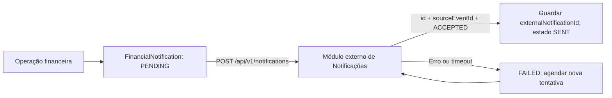

# Contratos Financial — Integração com o módulo Financeiro

**Projecto:** SMART CAMPUS / UJAC  
**Módulo responsável:** Gestão Financeira de Estudantes (`financial`)  
**Versão documental:** 1.0 — 18 de Setembro de 2026  
**Destinatários:** grupos de Estudantes e Docentes, Avaliações, Horários, Notificações e futuros consumidores autorizados.

Este é o **documento central de referência para integração com o Financeiro**. Reúne os contratos que o módulo fornece e aqueles que consome, com endpoints, dados, permissões, regras de negócio e tratamento de falhas. Pode ser partilhado como um único ficheiro Markdown: os contratos estão descritos aqui; as ligações para diagramas e OpenAPI são complementares.

**Estado:** os contratos académicos são propostas para acordo e implementação entre grupos. A regra de acesso às notas está confirmada na modelação: ACTIVE permite a consulta pelo estudante; BLOCKED impede-a. Isto não significa que o bloqueio já esteja implementado em Avaliações. O emissor de Notificações e os endpoints financeiros assinalados como existentes estão implementados localmente; a recepção externa não foi validada com uma API real.

## Guia de consulta

- [Catálogo e estado dos contratos](#catalogo).
- [Responsabilidades e decisões de negócio](#responsabilidades).
- [Convenções comuns](#convencoes).
- [C1 — Identidade académica](#c1).
- [C2 — Regularidade financeira e acesso às notas](#c2).
- [C3 — Avaliações e cobranças](#c3).
- [C4 — Horários e participantes](#c4).
- [Fluxo académico e recuperação](#fluxo).
- [Critérios de validação académica](#validacao).
- [C5 — Notificações, entrega e configuração](#c5).
- [Acordo entre grupos e evolução](#acordo).

<a id="catalogo"></a>

## Catálogo e estado dos contratos

As rotas abaixo são relativas à URL base do **módulo fornecedor**, a acordar com cada grupo. `/api/v1` é a versão HTTP; a versão documental acima não representa uma publicação da API. Não existe ainda uma URL partilhada confirmada neste documento.

| Contrato | Fornecedor → consumidor | Operação | Estado |
|---|---|---|---|
| C1 | Estudantes e Docentes → Financeiro / Avaliações | GET `/api/v1/academic/students/by-user/:userId` | Proposto |
| C1 | Estudantes e Docentes → Horários / Financeiro quando necessário | GET `/api/v1/academic/teachers/by-user/:userId` | Proposto |
| C2 | Financeiro → utilizadores autenticados do Core | GET `/api/v1/financial/students/:studentId/status` | Existente, com limitações descritas em C2 |
| C2 | Financeiro → Estudantes e Docentes / Avaliações | GET `/api/v1/financial/integration/students/:studentUserId/standing` | Proposto |
| C3 | Avaliações → Financeiro | GET `/api/v1/assessments/registrations/:registrationId` | Proposto |
| C3 | Avaliações → Financeiro | GET `/api/v1/assessments/:assessmentId` | Proposto |
| C3 | Financeiro → Avaliações | POST `/api/v1/financial/integration/assessment-charges` | Proposto |
| C3 | Financeiro → Avaliações | GET `/api/v1/financial/integration/assessment-charges/:debtId` | Proposto |
| C4 | Horários → Financeiro / Avaliações | GET `/api/v1/schedules/sessions/:sessionId` | Proposto |
| C4 | Avaliações → Horários | GET `/api/v1/assessments/:assessmentId/registrations` | Proposto; filtros em C4 |
| C5 | Notificações → Financeiro (recepção de avisos) | POST `/api/v1/notifications` | Emissor implementado; contrato do receptor proposto |
| C5 | Financeiro → operadores FINANCE / ADMIN | GET `/api/v1/financial/notifications/:notificationId/delivery` | Implementado |
| C5 | Financeiro → operadores FINANCE / ADMIN | POST `/api/v1/financial/notifications/:notificationId/retry` | Implementado |

“Fornecedor” identifica quem expõe o endpoint; “consumidor” identifica quem o chama. Outros módulos podem solicitar acesso ao C2, mas não recebem permissões automaticamente. Os endpoints administrativos de dívida, pagamento e política não constituem autorização para módulos externos alterarem dados financeiros.

<a id="responsabilidades"></a>

## Responsabilidades e decisões de negócio

| Módulo | Fornece | Consome |
|---|---|---|
| Estudantes e Docentes | Identidade académica ligada ao User.id; situação académica; identificação do docente responsável | Regularidade financeira para operações de inscrição sujeitas à política institucional |
| Avaliações | Avaliação, inscrição e pedido de taxa de exame/recurso | Regularidade financeira para acesso às notas e situação da dívida específica da inscrição |
| Horários | Sessão da avaliação, data, sala e docente responsável | Inscrições confirmadas por Avaliações para compor a lista de participantes |
| Financeiro | Dívida, confirmação de pagamento e regularidade financeira | Identidade académica, inscrição de origem e contexto da sessão |

A relação com Horários é de contexto e planeamento: o Financeiro pode consultar a sessão para identificar a cobrança; Horários recebe de Avaliações as inscrições confirmadas. Consultar o horário normal de aulas não depende de uma dívida. Não se propõe cobrar pela simples criação ou alteração de um horário.

`ACTIVE` significa regularidade financeira segundo as regras do Financeiro, não aprovação académica nem prova de pagamento de uma taxa específica. Para confirmar inscrição numa avaliação paga, Avaliações deve verificar tanto a regularidade como a liquidação da taxa associada. `BLOCKED` impede a confirmação da inscrição nesta proposta; a especificação financeira já prevê restrições às inscrições e pautas de exames. Para o acesso do estudante às notas, a regra acordada nesta modelação é explícita: ACTIVE permite a consulta e BLOCKED impede a consulta. As notas, inscrições e horários existentes continuam guardados. A implementação entre grupos permanece pendente.

<a id="convencoes"></a>

## Convenções comuns do contrato v1

- Rotas `/api/v1`, JSON e datas ISO 8601 com fuso horário, preferencialmente UTC (`Z`). IDs são strings opacas.
- Identidade partilhada: `studentUserId` e `teacherUserId` são `User.id`. No Financeiro, o campo existente `studentId` também contém esse ID. IDs de perfis académicos e números de matrícula não o substituem.
- Sucesso: `{ "data": ..., "meta": { "correlationId": "...", "timestamp": "..." } }`. Erro: `{ "code": "...", "message": "...", "correlationId": "..." }`, com `details` opcional. Propagar `x-correlation-id` também no cabeçalho de resposta.
- Consultas devolvem `200`; recursos desconhecidos, `404`; dados inválidos, `400`; ausência de autenticação, `401`; falta de permissão, `403`; conflito, `409`; indisponibilidade, `503`.
- Para APIs de grupos separados, usar HTTPS e credenciais de serviço restritas por consumidor e operação. As permissões descritas abaixo são propostas, ainda não suportadas pelo middleware JWT actual. Não reutilizar a conta ADMIN como identidade de um módulo.
- No monólito, a mesma fronteira pode ser uma interface de aplicação com os mesmos DTOs e autorizações. Cada módulo escreve apenas nos dados de que é responsável; não se criam FK entre bases externas.
- Montantes dos novos contratos são strings decimais com duas casas e moeda `MZN`; a consulta financeira existente usa números. Nunca devolver passwordHash, credenciais, histórico de pagamentos ou saldos a Horários.

<a id="c1"></a>

## C1 — Identidade académica

**Fornecedor:** Estudantes e Docentes. **Consumidores:** Financeiro e Avaliações, com permissão de leitura de identidade académica.

`GET /api/v1/academic/students/by-user/:userId`

Exemplo de `data`:

```json
{
  "id": "student_001",
  "userId": "usr_student_01",
  "studentNumber": "2024080003",
  "academicStatus": "ACTIVE"
}
```

Os quatro campos são obrigatórios. O Financeiro valida a correspondência com o utilizador local antes de aceitar uma cobrança. Perfil inexistente retorna `404 STUDENT_NOT_FOUND`; indisponibilidade não equivale a estudante inexistente. A inactivação académica não apaga dívidas nem altera automaticamente o estado financeiro.

`GET /api/v1/academic/teachers/by-user/:userId` fornece `data: { id, userId, departmentId }`, sendo `departmentId` anulável. Horários usa esta consulta para validar o responsável; o Financeiro só a usa se precisar desse contexto. Ser docente não autoriza criar dívidas nem confirmar pagamentos.

<a id="c2"></a>

## C2 — Regularidade financeira

**Existente:** `GET /api/v1/financial/students/:studentId/status`.

O endpoint usa JWT do Core. Actualmente impede STUDENT de consultar outro estudante, mas não implementa permissões específicas para identidades de módulos. Retorna em `data`: `studentId`, `status`, `reason`, `blockedAt`, `overdueDebtsCount`, `totalOverdueAmount` e `updatedAt`.

**Limites observados no código actual:** a consulta não verifica se o estudante existe e pode devolver ACTIVE para um ID desconhecido; calcula o estado a partir das dívidas já marcadas VENCIDA. Estes comportamentos precisam de ser tratados antes de usar esta rota como decisão automática entre grupos. `updatedAt` não é uma versão de decisão nem garante que houve actualização dos vencimentos.

**Contrato mínimo proposto para integração:** `GET /api/v1/financial/integration/students/:studentUserId/standing`, acessível a Estudantes e Docentes e Avaliações com permissão de consulta de regularidade.

```json
{
  "data": {
    "studentUserId": "usr_student_01",
    "status": "ACTIVE",
    "checkedAt": "2026-09-18T08:00:00.000Z"
  },
  "meta": {
    "correlationId": "corr_001",
    "timestamp": "2026-09-18T08:00:00.000Z"
  }
}
```

Todos os campos são obrigatórios; `status` é ACTIVE ou BLOCKED. A implementação deve validar a existência e o perfil do estudante, actualizar/considerar os vencimentos segundo a política financeira e devolver `404 STUDENT_NOT_FOUND` para identidade desconhecida. Não expõe montantes nem motivos detalhados aos consumidores académicos.

Consulta imediatamente antes da confirmação da operação. A resposta é uma observação naquele instante, não uma reserva: alterações posteriores não cancelam automaticamente uma inscrição confirmada. Timeout/503 deixa a operação pendente para nova tentativa, sem atribuir ACTIVE ou BLOCKED por defeito.

### C2.1 — Aplicação da regularidade ao acesso às notas

**Responsável pela decisão e bloqueio:** API de Avaliações. **Fonte do estado:** Financeiro, pelo contrato C2. Esta regra de modelação foi confirmada; a integração ainda não está implementada.

Antes de cada pedido do estudante que devolva notas (listagem, detalhe ou exportação), Avaliações verifica a identidade e autorização académica e consulta a regularidade pelo ID do Core. Nesta versão, não reutiliza uma decisão antiga guardada na sessão.

| Resposta do Financeiro | Resposta da API de Avaliações ao estudante |
|---|---|
| 200 com ACTIVE para o estudante pedido | Prossegue com a consulta das próprias notas, sujeita às regras académicas. |
| 200 com BLOCKED para o estudante pedido | `403 FINANCIAL_ACCESS_BLOCKED`, sem notas no corpo. |
| Timeout, 429/5xx, resposta inválida ou identidade divergente | `503 FINANCIAL_VERIFICATION_UNAVAILABLE`, sem notas; permite nova tentativa. |
| 404 STUDENT_NOT_FOUND | `404 STUDENT_NOT_FOUND`, sem notas; requer correcção da identidade. |
| 401/403 na chamada entre módulos | Tratar como falha de configuração da integração: `503 FINANCIAL_VERIFICATION_UNAVAILABLE`, sem notas, e registar para correcção. |

Exemplo do bloqueio devolvido por Avaliações, usando o envelope comum:

```json
{
  "code": "FINANCIAL_ACCESS_BLOCKED",
  "message": "A consulta das notas está indisponível. Regularize a sua situação financeira.",
  "correlationId": "corr_001"
}
```

Uma falha de comunicação apresenta a mensagem «Não foi possível verificar a regularidade financeira. Tente novamente.» e nunca deve ser apresentada como dívida confirmada. Depois da regularização, uma nova consulta com ACTIVE permite o acesso. O bloqueio afecta a leitura pelo estudante, não o armazenamento nem o lançamento das notas pelos docentes. A restrição deve existir no servidor; esconder ligações ou botões não impede acesso directo à API.

<a id="c3"></a>

## C3 — Avaliação e pedido de cobrança

**Fornecedor da inscrição:** Avaliações. **Consumidor:** Financeiro.

`GET /api/v1/assessments/registrations/:registrationId`

`data` obrigatório: `id: string`, `assessmentId: string`, `studentUserId: string`, `status: PENDING | CONFIRMED | CANCELLED`; `scheduleSessionId: string | null` é obrigatório mas anulável. O Financeiro valida estudante, inscrição não cancelada e correspondência com a sessão indicada. Se necessário, `GET /api/v1/assessments/:assessmentId` fornece `data: { id, courseUnitId, type }`, todos strings obrigatórias.

**Fornecedor da cobrança:** Financeiro. **Consumidor autorizado:** serviço de Avaliações.

```http
POST /api/v1/financial/integration/assessment-charges
Authorization: Bearer <credencial-de-servico>
Idempotency-Key: assessments:req_001
x-correlation-id: corr_001
Content-Type: application/json
```

```json
{
  "sourceModule": "assessments",
  "sourceRequestId": "req_001",
  "studentUserId": "usr_student_01",
  "externalRegistrationId": "registration_001",
  "externalScheduleSessionId": "session_001",
  "feeCode": "EXAM_RESIT"
}
```

Todos os campos são strings não vazias obrigatórias, excepto `externalScheduleSessionId`, opcional/anulável. `sourceModule` é fixo e deve corresponder à identidade autenticada. O Financeiro define valor, descrição e vencimento a partir de um catálogo de taxas aprovado, ainda a implementar. Avaliações não escolhe livremente montantes nem confirma pagamentos. Código de taxa desconhecido: `400 UNKNOWN_FEE_CODE`; identidade ou inscrição desconhecida: `404`; divergência de estudante/sessão ou inscrição cancelada: `409 REGISTRATION_CONFLICT`.

Resposta `201` na criação e `200` na repetição idêntica, com o mesmo `debtId`:

```json
{
  "data": {
    "sourceRequestId": "req_001",
    "debtId": "debt_001",
    "studentUserId": "usr_student_01",
    "externalRegistrationId": "registration_001",
    "feeCode": "EXAM_RESIT",
    "amount": "1500.00",
    "currency": "MZN",
    "dueDate": "2026-09-25T21:59:59.000Z",
    "status": "PENDENTE"
  },
  "meta": { "correlationId": "corr_001", "timestamp": "2026-09-18T08:00:00.000Z" }
}
```

Todos os campos da resposta são obrigatórios. `status` usa DebtStatus: `PENDENTE`, `VENCIDA`, `REGULARIZADA` ou `CANCELADA`. Criação e deduplicação devem ser atómicas, com unicidade composta de `(sourceModule, sourceRequestId)` e de `(sourceModule, externalRegistrationId, feeCode)`. Repetir a chave com conteúdo diferente devolve `409 IDEMPOTENCY_CONFLICT`; pedir a mesma taxa da mesma inscrição com nova chave devolve `409 CHARGE_ALREADY_EXISTS`. Preservar os valores originais em repetições, mesmo se o catálogo mudar. Guardar o pedido normalizado para comparação, incluindo a sessão opcional.

`GET /api/v1/financial/integration/assessment-charges/:debtId` devolve o mesmo formato com o estado actual. Avaliações apenas pode consultar cobranças da sua origem; o consumidor confirma a correspondência de estudante, inscrição e taxa. `REGULARIZADA` permite considerar a taxa liquidada; PENDENTE/VENCIDA mantém a inscrição pendente; CANCELADA exige revisão da cobrança, não prova de pagamento. Uma contestação procedente pode regularizar a dívida sem pagamento, conforme a regra financeira existente.

<a id="c4"></a>

## C4 — Contexto de Horários

**Fornecedor:** Horários. **Consumidores:** Avaliações e Financeiro, com leitura de sessões de avaliação.

`GET /api/v1/schedules/sessions/:sessionId`

Exemplo de `data`, com todos os campos obrigatórios:

```json
{
  "id": "session_001",
  "assessmentId": "assessment_001",
  "responsibleTeacherUserId": "usr_teacher_01",
  "roomId": "room_001",
  "startsAt": "2026-09-28T08:00:00.000Z",
  "endsAt": "2026-09-28T10:00:00.000Z",
  "status": "SCHEDULED"
}
```

`endsAt` deve ser posterior a `startsAt`; `status` aceita SCHEDULED/CANCELLED. A sessão deve pertencer à avaliação da inscrição. Uma sessão cancelada impede uma nova cobrança associada a essa sessão. A mudança de data/sala não modifica automaticamente `Debt.dueDate` nem gera outra taxa; uma correcção financeira é decisão auditada da tesouraria.

Para obter participantes, Horários consulta Avaliações: `GET /api/v1/assessments/:assessmentId/registrations?status=CONFIRMED&cursor=<cursor>&limit=50`. Resposta proposta: `data` contém uma lista de `{ id, assessmentId, studentUserId, scheduleSessionId, status }`; `meta` inclui `correlationId`, `timestamp` e `nextCursor: string | null`. `status` deve ser CONFIRMED; `scheduleSessionId` pode ser null. Limite entre 1 e 100, cursor opaco e ordenação estável por ID. Horários selecciona inscrições da sessão pertinente; uma inscrição sem sessão ainda requer atribuição por Avaliações. Não consulta o saldo financeiro de cada estudante para construir o horário.

<a id="fluxo"></a>

## Fluxo integrado e recuperação

1. Avaliações valida o estudante no módulo académico e cria uma inscrição PENDING.
2. Se houver taxa, consulta a sessão em Horários e solicita a cobrança ao Financeiro com chave estável; guarda o debtId devolvido.
3. O Financeiro valida as referências, cria a dívida e o aviso na mesma transacção local; envia o aviso pelo contrato C5 de Notificações, descrito neste documento, após commit.
4. A tesouraria confirma o pagamento pelo fluxo existente. Avaliações consulta a taxa específica e a regularidade financeira antes de confirmar a inscrição.
5. Horários consulta as inscrições CONFIRMED em Avaliações para planear os participantes; obtém a identidade do docente em Estudantes e Docentes.
6. Ao consultar notas, o estudante faz o pedido a Avaliações, que verifica a regularidade: ACTIVE permite a consulta; BLOCKED devolve 403; falha na verificação devolve 503 sem notas.

A proposta inicial usa consultas REST, sem exigir um barramento de eventos. Em timeout de criação de cobrança, Avaliações repete com a mesma chave. Proposta operacional: timeout de 5 segundos, até 3 tentativas automáticas com espera crescente para falhas de rede/429/5xx, respeitando Retry-After; depois manter pendente e permitir retoma com a mesma chave. Erros 400/401/403/404/409 exigem correcção ou tratamento específico, não repetição cega.

Não existe transacção distribuída: uma falha na confirmação da inscrição não desfaz um pagamento. Cada módulo conserva IDs e correlationId para reconciliação. Cancelar uma inscrição/sessão não cancela nem reembolsa automaticamente uma dívida; o caso segue para decisão financeira auditada. Não se pressupõe implementação de reembolsos nesta versão.

<a id="validacao"></a>

## Critérios para validar entre os grupos

| Cenário | Resultado esperado |
|---|---|
| Matrícula usada em vez de User.id ou estudante inexistente | Rejeitar a identidade; nunca responder ACTIVE por ausência de dados |
| Mesmo pedido enviado duas vezes, incluindo em concorrência | Uma única dívida e o mesmo debtId |
| Mesma chave, conteúdo diferente | 409 IDEMPOTENCY_CONFLICT |
| Nova chave para a mesma inscrição e taxa | 409 CHARGE_ALREADY_EXISTS |
| Consulta de notas com ACTIVE | Devolve as próprias notas quando as regras académicas também permitem |
| Consulta de notas com BLOCKED, incluindo exportação ou acesso directo à API | 403 FINANCIAL_ACCESS_BLOCKED, sem notas |
| Consulta de notas com timeout no Financeiro | 503 FINANCIAL_VERIFICATION_UNAVAILABLE, sem atribuir BLOCKED |
| Consulta de notas após regularização | Nova verificação ACTIVE permite acesso, sem reutilizar bloqueio antigo |
| Estado ACTIVE mas taxa específica ainda pendente | Inscrição permanece PENDING |
| Taxa regularizada mas outra dívida causa BLOCKED | Inscrição permanece PENDING |
| Financeiro indisponível | Estado de verificação pendente, sem decisão financeira inventada |
| Alteração da sala/data ou cancelamento da sessão | Sem cobrança duplicada nem reembolso automático |
| Horários tenta criar dívida ou consultar detalhes de cobrança | 403; acesso limitado ao seu contrato |

Antes da implementação conjunta, acordar nomes e URLs reais, credenciais e permissões, IDs do Core, catálogo/valores/vencimentos das taxas, regras de inscrição e restrições de acesso, cardinalidade de docentes por sessão e responsáveis por cada endpoint. Estes contratos são uma base concreta para esse acordo, não confirmação de aceitação pelos outros grupos.


<a id="c5"></a>

## C5 — Financeiro e Notificações

**Estado:** emissor implementado; receptor proposto para validação pelo grupo de Notificações.

### Responsabilidades e relação entre módulos

O Financeiro cria o aviso juntamente com a operação financeira, na mesma transacção. Após o commit, tenta enviá-lo por HTTP. O módulo de Notificações recebe, guarda e apresenta o aviso ao destinatário. A leitura pelo estudante é responsabilidade desse módulo.

`FinancialNotification.externalNotificationId` guarda o `Notification.id` devolvido pelo receptor. É uma **referência externa opcional e única**, não uma FK PostgreSQL, porque os módulos usam APIs/bases separadas. Para avisos financeiros aceites, a relação lógica é 1:1; antes da aceitação, um aviso local tem zero notificações externas associadas. O receptor pode também conter notificações de outros módulos.

O receptor deve guardar `sourceModule` e `sourceEventId` com unicidade composta. `sourceEventId` é sempre o ID local de `FinancialNotification`, permitindo repetir uma tentativa sem criar outro aviso. Os dois grupos devem utilizar o mesmo identificador de utilizador do Core: `recipientUserId = User.id`, não o número de matrícula.



### Endpoint a implementar pelo outro grupo

```http
POST /api/v1/notifications
Authorization: Bearer <credencial-de-servico>
Content-Type: application/json
Idempotency-Key: financial:<sourceEventId>
x-correlation-id: <identificador-da-operacao>
```

URL completa configurável no Financeiro. O token é uma credencial entre serviços fornecida pelo grupo receptor, com permissão para criar notificações de origem `financial`. Não é encaminhado o JWT do estudante. Usar HTTPS no ambiente partilhado e guardar a credencial apenas na configuração do servidor.

Corpo proposto:

```json
{
  "sourceModule": "financial",
  "sourceEventId": "cm_aviso_001",
  "recipientUserId": "usr_student_01",
  "eventType": "DEBT_CREATED",
  "resourceId": "cm_divida_001",
  "title": "Nova Divida Registada",
  "message": "Foi emitida uma nova divida no valor de 3500 MZN.",
  "channel": "IN_APP",
  "occurredAt": "2026-09-17T08:00:00.000Z"
}
```

| Campo | Tipo | Regra |
|---|---|---|
| sourceModule | string | Sempre `financial` |
| sourceEventId | string | ID imutável do aviso financeiro; chave de idempotência |
| recipientUserId | string | ID do utilizador do Core |
| eventType | string | Tipo de evento da tabela abaixo |
| resourceId | string ou null | ID da dívida, pagamento ou pedido; null em aviso genérico |
| title | string | Título do aviso |
| message | string | Conteúdo do aviso |
| channel | string | `IN_APP` nesta versão |
| occurredAt | string ISO 8601 | Data original; mantém-se nos reenvios |

| Evento | Quando é gerado | resourceId |
|---|---|---|
| DEBT_CREATED | Criação de dívida | Debt.id |
| PAYMENT_CONFIRMED | Confirmação de pagamento | Payment.id |
| ANALYSIS_REQUEST_RESOLVED | Resolução de contestação | AnalysisRequest.id |
| FINANCIAL_NOTICE | Aviso genérico criado no registo local | Pode ser null |

#### Resposta obrigatória

`201 Created` para a primeira recepção; `200 OK` para uma repetição do mesmo evento:

```json
{
  "data": {
    "id": "notif_001",
    "sourceEventId": "cm_aviso_001",
    "status": "ACCEPTED"
  },
  "meta": {
    "correlationId": "identificador-da-operacao",
    "timestamp": "2026-09-17T08:00:01.000Z"
  }
}
```

O receptor só confirma depois de persistir o aviso. Em repetição, devolve o mesmo `id`, sem duplicar a notificação. Deve comparar o conteúdo de um evento repetido e rejeitar conteúdo diferente com `409 IDEMPOTENCY_CONFLICT`. A criação e a deduplicação devem ser atómicas no receptor.

O Financeiro valida `data.id`, `data.sourceEventId` e `data.status`. Uma resposta vazia, um evento diferente ou outro código HTTP é tratado como falha. **SENT significa aceite pelo módulo externo, não lido pelo estudante nem entregue por SMS/email.**

Erros propostos: `400` dados inválidos; `401` credencial inválida; `403` origem sem permissão; `404` destinatário inexistente; `409` conflito de idempotência; `429` limite de pedidos; `500/503` falha temporária. Usar envelope `{ code, message, correlationId }`. O corpo de erro externo não é guardado no Financeiro.

A definição legível por ferramentas está em [contrato-notificacoes.openapi.json](contrato-notificacoes.openapi.json).

### Endpoints implementados no Financeiro

Autenticação JWT do Core, perfis **FINANCE ou ADMIN**:

| Método | Endpoint | Finalidade |
|---|---|---|
| GET | `/api/v1/financial/notifications/:notificationId/delivery` | Consultar estado do envio |
| POST | `/api/v1/financial/notifications/:notificationId/retry` | Tentar novamente um aviso pendente/falhado; corpo `{}` |

Exemplo de resposta, dentro de `data`:

```json
{
  "id": "cm_aviso_001",
  "deliveryStatus": "SENT",
  "externalNotificationId": "notif_001",
  "attempts": 2,
  "lastAttemptAt": "2026-09-17T08:01:00.000Z",
  "nextAttemptAt": null,
  "sentAt": "2026-09-17T08:01:01.000Z",
  "lastError": null
}
```

O POST retorna `200` se aceite/já enviado ou se for um aviso histórico `LOCAL_ONLY`; `202` se continuar pendente, em processamento ou falhado (ver `data.deliveryStatus`); `503 NOTIFICATIONS_NOT_CONFIGURED` se faltar configuração para enviar. Retorna ainda `400`, `401`, `403` ou `404` conforme validação, autenticação, perfil e existência. Não permite alterar o destinatário, conteúdo ou URL. O pedido de nova tentativa é auditado. Avisos `SENT` e `LOCAL_ONLY` não são reenviados.

O endpoint existente `GET /api/v1/financial/students/:studentId/notifications` conserva o seu formato. O campo `read` mantém compatibilidade local e **não é sincronizado** com a leitura no módulo externo nesta versão.

### Entrega, recuperação e configuração

Estados: `LOCAL_ONLY` (histórico anterior à integração), `PENDING`, `PROCESSING`, `SENT` e `FAILED`.

- A operação financeira e o aviso são gravados atomicamente; não há HTTP dentro da transacção.
- Há uma tentativa imediata após commit, com timeout de 5 segundos por defeito. Uma falha externa não desfaz a dívida/pagamento/decisão.
- Enquanto o servidor API estiver activo, verifica a fila de 30 em 30 segundos, em lotes de até 10 avisos. O intervalo entre tentativas começa em 30 segundos, duplica e fica limitado a uma hora. Falhas de configuração/autorização no receptor também ficam visíveis em `lastError` e requerem correcção.
- Uma reserva por aviso evita envios concorrentes. Reservas abandonadas expiram após timeout + 60 segundos; o envio pode então ser retomado.
- A entrega é **pelo menos uma vez**. Em caso de confirmação perdida ou interrupção do processo, a idempotência no receptor impede duplicados.
- Sem URL/token válidos, novos avisos ficam `PENDING`, sem pedidos HTTP nem consumo de tentativas. Não há envio retroactivo automático dos avisos anteriores à migração.

Configurar na raiz do projecto e reiniciar a API após o acordo com o outro grupo:

```dotenv
NOTIFICATIONS_API_URL=https://host-do-grupo/api/v1/notifications
NOTIFICATIONS_API_TOKEN=credencial-fornecida-pelo-grupo
NOTIFICATIONS_TIMEOUT_MS=5000
NOTIFICATIONS_POLL_INTERVAL_MS=30000
```

Migração: `20260917000000_add_notification_delivery`. Acrescenta colunas e índices e preserva os registos antigos como `LOCAL_ONLY`. As FK existentes para User permanecem.

Antes da integração real, os grupos precisam de acordar URL, autenticação, IDs do Core, recepção idempotente e formato de confirmação. Os testes locais usam um receptor HTTP simulado; não comprovam o comportamento da API do outro grupo.

<a id="acordo"></a>

## Acordo entre grupos e evolução

Para cada integração, registar o grupo fornecedor e consumidor, URL por ambiente, contacto técnico, método de autenticação, permissões concedidas e resultado dos cenários de validação. Partilhar credenciais por canal próprio, nunca neste documento. Enquanto estes dados não estiverem acordados e testados, a integração permanece proposta.

As futuras alterações de contrato devem ser actualizadas **neste ficheiro**, com data e versão documental. Mudanças incompatíveis em campos obrigatórios, estados ou comportamento exigem acordo com os consumidores e uma estratégia de migração antes de publicação. Os exemplos usam IDs ilustrativos e não credenciais ou endereços reais.

Validação específica de Notificações: confirmar persistência antes do ACK; repetição idêntica devolve o mesmo ID; conteúdo divergente devolve 409; falha de rede permite retoma sem duplicar avisos; SENT não representa leitura. Validar com o receptor real antes de declarar a integração operacional.

Materiais complementares: [atributos e relações](exercicio-1/atributos-e-relacoes.md), [diagrama visual](exercicio-1/diagrama-financeiro.html) e [OpenAPI de Notificações](contrato-notificacoes.openapi.json). Não há ainda uma definição OpenAPI consolidada dos contratos académicos.
