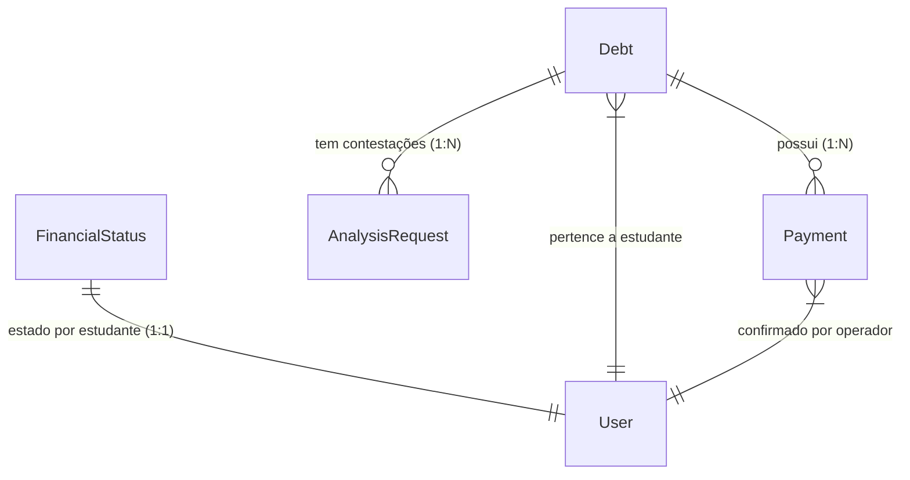

# Documentação Técnica e Guia de Apresentação — Semana 5
## Módulo: Gestão Financeira de Estudantes (`financial`)
**PTP III — Universidade Joaquim Chissano (UJAC)**  
**Autores (Grupo):** Alípio Anderson Moisés Paço (2024080003) & Jocar Célio Elias (2024080038)  

---

## 1. Visão Geral da Solução

O módulo **Gestão Financeira de Estudantes** foi desenvolvido segundo a arquitectura em camadas definida na Semana 3 e Semana 4, garantindo separação rigorosa de responsabilidades:

- **Domínio (`domain/financial.domain.ts`)**: Tipos puros TypeScript e funções de mapeamento sem acoplamento a bibliotecas externas.
- **Infra-estrutura (`infrastructure/financialRepository.ts`)**: Encapsula todas as chamadas ao Prisma Client, desacoplando a base de dados da camada de aplicação.
- **Schemas (`schemas/index.ts`)**: Re-exporta os schemas Zod do pacote partilhado, centralizando as importações no módulo.
- **Validação (`packages/validation`)**: Schemas Zod para validar payloads de entrada com mensagens de erro em Português.
- **Aplicação (`application/financialService.ts`)**: Regras de negócio, cálculos financeiros e persistência real com Prisma Client e transacções ACID `$transaction`.
- **HTTP (`http/financialRouter.ts`)**: Endpoints RESTful Express com middleware de Autenticação (JWT), Autorização RBAC por perfil (`FINANCE`, `ADMIN`, `STUDENT`) e tratamento centralizado de erros com envelope `correlationId`.
- **Cliente SDK (`packages/api-client`)**: Métodos tipados para consumo do módulo financeiro a partir do frontend React.

---

## 2. Estrutura Completa de Pastas do Módulo

```
apps/api/src/modules/financial/
├── domain/
│   └── financial.domain.ts         ← Tipos puros, enums, funções de mapeamento (Prisma → DTO)
├── infrastructure/
│   └── financialRepository.ts      ← [NOVO] Encapsula todas as queries Prisma (Repository Pattern)
├── schemas/
│   └── index.ts                    ← [NOVO] Re-exporta schemas Zod do @smart-campus/validation
├── application/
│   └── financialService.ts         ← Casos de uso, regras de negócio, transacções ACID
├── http/
│   └── financialRouter.ts          ← Rotas Express, autenticação JWT, autorização RBAC
└── tests/
    └── financial.test.ts           ← Suíte de 11 testes Jest + Supertest
```

### Porquê cada camada?

| Camada | Responsabilidade | Dependências |
| :--- | :--- | :--- |
| `domain/` | Tipos e mapeamentos puros | Apenas `@smart-campus/shared-types` |
| `infrastructure/` | Acesso à base de dados | `@prisma/client` |
| `schemas/` | Contratos de validação de entrada | `@smart-campus/validation` |
| `application/` | Regras de negócio e orquestração | `domain/`, `infrastructure/`, `schemas/` |
| `http/` | Protocolo HTTP (rotas, middlewares) | `application/`, middlewares |
| `tests/` | Verificação automática de contratos | `supertest`, `jest` |

---

## 3. Conformidade com a Ficha de Preparação — Semana 5

### Matriz de Conformidade (100% Atingido)

| # | Requisito da Ficha | Ficheiro / Local no Projecto | Estado |
| :- | :--- | :--- | :---: |
| 1 | **Estrutura de pastas** com camadas `domain`, `application`, `http`, `tests`, `infrastructure`, `schemas` | `apps/api/src/modules/financial/` | ✅ 100% |
| 2 | **Entidades & Modelos** no Prisma (`Debt`, `Payment`, `FinancialStatus`, `AnalysisRequest`, `FinancialNotification`, `FinancialPolicy`) | `apps/api/prisma/schema.prisma` | ✅ 100% |
| 3 | **DTOs em pacote partilhado** (`DebtDto`, `PaymentDto`, `FinancialStatusSummaryDto`, etc.) | `packages/shared-types/src/index.ts` | ✅ 100% |
| 4 | **Schemas Zod** de validação com mensagens em PT | `packages/validation/src/index.ts` | ✅ 100% |
| 5 | **Métodos no Cliente HTTP SDK** para todo o módulo financeiro | `packages/api-client/src/index.ts` | ✅ 100% |
| 6 | **Rota registada** no router principal da API | `apps/api/src/routes/v1.ts` | ✅ 100% |
| 7 | **CRUD completo** com validação 400, regras de negócio (update/delete), transacção ACID | `application/financialService.ts` | ✅ 100% |
| 8 | **Documentação OpenAPI/Swagger** acessível em `/api/docs` | `apps/api/src/config/swagger.ts` | ✅ 100% |

---

## 4. Respostas às Perguntas da Ficha de Preparação

### ❓ Pergunta 1: O que é uma API RESTful e quais são os seus princípios fundamentais?

**Resposta:**

Uma **API RESTful** (Representational State Transfer) é uma interface de comunicação entre sistemas que segue os princípios arquitectónicos REST, definidos por Roy Fielding em 2000.

Os **6 princípios fundamentais** são:

1. **Interface Uniforme** — Cada recurso é identificado por uma URI única (ex: `/api/v1/financial/debts/123`), os recursos são manipulados através de representações (JSON), as mensagens são auto-descritivas e o HATEOAS permite navegação por links.
2. **Stateless (Sem Estado)** — Cada requisição contém toda a informação necessária para ser processada (JWT, correlationId). O servidor não guarda estado de sessão entre requisições.
3. **Cacheable** — As respostas indicam se podem ser armazenadas em cache, melhorando a performance.
4. **Client-Server (Cliente-Servidor)** — A interface separa o frontend (React) do backend (Express/API), permitindo que evoluam independentemente.
5. **Layered System (Sistema em Camadas)** — O cliente não sabe se está a comunicar com o servidor real ou com um proxy/load balancer.
6. **Code on Demand (opcional)** — O servidor pode enviar código executável ao cliente.

**No nosso projecto**, aplicamos REST no módulo `financial`:
- URIs por recurso: `/debts`, `/payments`, `/students/:id/status`
- Verbos HTTP semânticos: `GET` (ler), `POST` (criar), `PATCH` (actualizar parcialmente)
- Respostas com envelope padronizado: `{ data, meta: { correlationId, timestamp } }`

---

### ❓ Pergunta 2: Qual é a diferença entre os métodos HTTP GET, POST, PUT e PATCH?

**Resposta:**

| Método | Idempotente? | Semântica | Uso no nosso módulo |
| :--- | :---: | :--- | :--- |
| `GET` | ✅ Sim | Ler/listar recursos sem alterar estado | `GET /debts`, `GET /students/:id/status` |
| `POST` | ❌ Não | Criar um novo recurso (gera novo ID) | `POST /debts`, `POST /payments`, `POST /analysis-requests` |
| `PUT` | ✅ Sim | Substituir um recurso completo | Não usado — prefere-se `PATCH` para actualizações parciais |
| `PATCH` | ❌ Não* | Actualizar parcialmente um recurso | `PATCH /analysis-requests/:id`, `PATCH /policies/:id` |

> *`PATCH` é conceptualmente não idempotente, embora na prática possa ser implementado como tal.

**Exemplo prático:** Ao resolver uma contestação, usamos `PATCH` porque só alteramos o campo `status` e `resolutionNotes`, sem substituir o registo inteiro.

---

### ❓ Pergunta 3: O que são códigos de status HTTP e para que servem?

**Resposta:**

Os **códigos de status HTTP** são números de 3 dígitos que o servidor inclui na resposta para indicar o resultado do processamento da requisição.

**Famílias de códigos:**

| Família | Significado | Exemplos no nosso módulo |
| :--- | :--- | :--- |
| `2xx` — Sucesso | A requisição foi processada com êxito | `200 OK` (leitura), `201 Created` (criação de dívida/pagamento) |
| `4xx` — Erro do Cliente | A requisição contém dados inválidos ou não permitidos | `400 Bad Request` (Zod rejeita payload), `401 Unauthorized` (sem JWT), `403 Forbidden` (STUDENT a criar dívida), `404 Not Found` (dívida inexistente), `409 Conflict` (contestação duplicada) |
| `5xx` — Erro do Servidor | Falha interna inesperada | `500 Internal Server Error` (excepção não tratada) |

**No nosso módulo, os testes Jest validam exactamente estes cenários:**
- `401` → requisição sem token JWT
- `403` → `STUDENT` a tentar chamar `POST /debts`
- `400` → payload sem campo obrigatório (Zod valida e rejeita)
- `404` → consulta de dívida com ID inexistente
- `409` → submeter segunda contestação para a mesma dívida
- `201` → criação bem-sucedida de dívida ou pagamento
- `200` → leitura de relatório ou estado financeiro

---

### ❓ Pergunta 4: O que é persistência de dados e como o Prisma ORM nos ajuda?

**Resposta:**

**Persistência de dados** é a capacidade de guardar informação de forma duradoura, de modo a que sobreviva ao término da aplicação. Sem persistência, todos os dados seriam perdidos ao reiniciar o servidor.

**Prisma ORM** é uma ferramenta que:
1. **Define o esquema** (`schema.prisma`) — declara as tabelas, colunas, tipos e relações num formato legível.
2. **Gera migrações SQL** automaticamente — `prisma migrate dev` cria ficheiros `.sql` versionados para o PostgreSQL.
3. **Gera o cliente tipado** (`@prisma/client`) — funções TypeScript seguras para criar, ler, actualizar e apagar registos.
4. **Garante Type Safety** — erros de tipagem são detectados em tempo de compilação, não em produção.

**Exemplo do nosso módulo:**

```prisma
// schema.prisma — declaração da entidade Debt
model Debt {
  id        String   @id @default(cuid())
  code      String   @unique
  studentId String
  title     String
  amount    Decimal
  status    String   @default("PENDENTE")
  dueDate   DateTime
  createdAt DateTime @default(now())
  updatedAt DateTime @updatedAt
  payments  Payment[]
}
```

```typescript
// financialService.ts — uso do cliente Prisma
const debt = await prisma.debt.create({ data: { code, studentId, ... } });
```

---

### ❓ Pergunta 5: O que são transacções ACID e por que são importantes?

**Resposta:**

Uma **transacção ACID** é um conjunto de operações na base de dados que se comporta como uma unidade atómica. O acrónimo significa:

| Propriedade | Significado | Aplicação no nosso módulo |
| :--- | :--- | :--- |
| **A**tomicity (Atomicidade) | Tudo corre ou nada corre | Se falhar ao actualizar o estado da dívida após criar o pagamento, o pagamento é revertido |
| **C**onsistency (Consistência) | A BD fica sempre num estado válido | Nunca existe um `Payment` criado para uma dívida que ainda aparece como `PENDENTE` |
| **I**solation (Isolamento) | Transacções concorrentes não se interferem | Dois pagamentos simultâneos para a mesma dívida não criam inconsistências |
| **D**urability (Durabilidade) | Dados confirmados sobrevivem a falhas | Após confirmação, o pagamento não se perde mesmo que o servidor reinicie |

**Implementação no `financialService.ts` com `prisma.$transaction`:**

```typescript
// createPayment() — 3 passos ACID
const resultado = await prisma.$transaction(async (tx) => {
  // Passo 1: Criar o Payment
  const payment = await tx.payment.create({ data: { ... } });

  // Passo 2: Actualizar a Debt para REGULARIZADA
  await tx.debt.update({ where: { id: input.debtId }, data: { status: 'REGULARIZADA' } });

  // Passo 3: Recalcular estado financeiro do estudante
  const novoEstado = await recalcularEstado(tx, debt.studentId);

  // Se qualquer passo falhar → todos os passos são revertidos (Atomicidade)
  return { payment, novoEstado };
});
```

---

### ❓ Pergunta 6: O que é validação de dados e por que é essencial?

**Resposta:**

**Validação de dados** é o processo de verificar se os dados recebidos numa requisição respeitam as regras esperadas antes de os processar ou gravar na base de dados.

**Por que é essencial?**
- Previne dados corrompidos na BD (ex: dívida com valor negativo)
- Protege contra ataques de injecção
- Fornece mensagens de erro claras ao utilizador
- Reduz erros em produção

**No nosso módulo usamos Zod** — uma biblioteca de validação TypeScript-first:

```typescript
// packages/validation/src/index.ts
export const createDebtSchema = z.object({
  studentId: z.string().min(1, 'O ID do estudante é obrigatório'),
  title:     z.string().trim().min(3, 'Título deve ter pelo menos 3 caracteres'),
  amount:    z.number().positive('O valor deve ser superior a zero'),
  origin:    z.string().trim().min(2, 'Origem é obrigatória'),
  dueDate:   z.string().datetime({ message: 'Data de vencimento inválida (ISO 8601)' }),
});

// financialRouter.ts — validação antes de chamar o service
const input = createDebtSchema.parse(req.body);
// → Se falhar: ZodError → errorHandler → resposta 400 estruturada
```

**Resposta 400 gerada automaticamente pelo errorHandler:**
```json
{
  "code": "VALIDATION_ERROR",
  "message": "Dados de entrada inválidos",
  "details": [
    { "path": "amount", "message": "O valor deve ser superior a zero" }
  ],
  "correlationId": "uuid-aqui"
}
```

---

## 5. Resumo dos Exercícios Implementados

### Exercício 1 — Modelação e Domínio Puro
- Definição do catálogo de dívidas, modalidades de pagamento e estados do estudante (`ACTIVE` / `BLOCKED`).
- **Ficheiros**: `domain/financial.domain.ts`.

### Exercício 2 — Esquema Prisma e Migração
- Criação das tabelas no PostgreSQL via Prisma ORM: `Debt`, `Payment`, `FinancialStatus`, `AnalysisRequest`, `FinancialNotification`, `FinancialPolicy`.
- **Migrações**: `20260910001000_add_financial_module` e `20260910052000_add_finance_role`.

### Exercício 3 — Endpoints REST CRUD com Zod
- 5 schemas Zod criados em `@smart-campus/validation`, centralizados em `schemas/index.ts`.
- Todos os payloads validados antes de atingir o serviço.

### Exercícios 4 & 5 — Regras de Negócio e Transacção ACID
- Pagamento executa em `prisma.$transaction` com 3 passos atómicos.
- Contestação impedida se dívida for de outro estudante (403) ou já existir contestação pendente (409).

### Exercício 6 — Testes Automatizados (Jest & Supertest)
- **11 testes com 100% de sucesso** cobrindo 400, 401, 403, 404, 409 e 200/201.

### Exercício 7 — Documentação Swagger & OpenAPI
- Swagger UI em `http://localhost:4100/api/docs`.

---

## 6. Catálogo das Rotas do Módulo (`/api/v1/financial`)

| Método | Endpoint | Perfil Autorizado | Descrição |
| :--- | :--- | :--- | :--- |
| `POST` | `/debts` | `FINANCE`, `ADMIN` | Criar nova dívida |
| `GET` | `/debts` | Todos autenticados | Listar dívidas |
| `GET` | `/debts/:id` | Todos autenticados | Consultar dívida por ID |
| `POST` | `/payments` | `FINANCE`, `ADMIN` | Registar pagamento (ACID) |
| `GET` | `/students/:id/status` | Todos autenticados | Estado financeiro |
| `GET` | `/students/:id/history` | Todos autenticados | Histórico financeiro |
| `GET` | `/students/:id/notifications` | Todos autenticados | Notificações financeiras |
| `POST` | `/analysis-requests` | `STUDENT` | Submeter contestação |
| `PATCH` | `/analysis-requests/:id` | `FINANCE`, `ADMIN` | Resolver contestação |
| `GET` | `/reports` | `FINANCE`, `ADMIN` | Relatório consolidado |
| `GET` | `/policies/:id` | `ADMIN` | Consultar política |
| `PATCH` | `/policies/:id` | `ADMIN` | Actualizar política |

---

## 7. Métodos do Cliente HTTP SDK (`packages/api-client`)

Os seguintes métodos foram adicionados à classe `SmartCampusApiClient`:

| Método | Endpoint | Tipo de Retorno |
| :--- | :--- | :--- |
| `getDebts(params?)` | `GET /financial/debts` | `DebtDto[]` |
| `getDebtById(id)` | `GET /financial/debts/:id` | `DebtDto` |
| `createDebt(input)` | `POST /financial/debts` | `DebtDto` |
| `createPayment(input)` | `POST /financial/payments` | `{ payment, debtStatus, studentFinancialStatus }` |
| `getStudentFinancialStatus(id)` | `GET /financial/students/:id/status` | `FinancialStatusSummaryDto` |
| `getStudentFinancialHistory(id)` | `GET /financial/students/:id/history` | `FinancialHistoryDto` |
| `getStudentFinancialNotifications(id)` | `GET /financial/students/:id/notifications` | `FinancialNotificationDto[]` |
| `createAnalysisRequest(input)` | `POST /financial/analysis-requests` | `AnalysisRequestDto` |
| `resolveAnalysisRequest(id, input)` | `PATCH /financial/analysis-requests/:id` | `AnalysisRequestDto` |
| `getFinancialReport()` | `GET /financial/reports` | relatório agregado |
| `getFinancialPolicy(id)` | `GET /financial/policies/:id` | `FinancialPolicyDto` |
| `updateFinancialPolicy(id, input)` | `PATCH /financial/policies/:id` | `FinancialPolicyDto` |

---

## 8. Guia Rápido de Demonstração na Apresentação

1. **Testes Automatizados:**
   ```bash
   npm test -- modules/financial
   ```
   *Demonstra os 11 testes a passar com envelopes 400, 403, 404, 401, 409 e 200.*

2. **Interface Swagger UI:**
   - Iniciar a API: `npm run dev:api`
   - Abrir: `http://localhost:4100/api/docs`
   - Expandir a secção **Gestão Financeira de Estudantes (Módulo Financial)**.

3. **Verificação no Banco de Dados:**
   ```bash
   npx prisma studio --schema=apps/api/prisma/schema.prisma
   ```
   *Visualizar as tabelas `Debt`, `Payment`, `FinancialStatus` com dados reais.*

---

## 9. Princípios Arquitectónicos e Boas Práticas da Solução

### 9.1 Modelação de Dados e Funcionamento do Módulo (`financial`)

O módulo foi desenhado com **6 entidades inter-relacionadas** no Prisma, que refletem os processos financeiros de uma instituição universitária:



#### Principais Acções do CRUD por Entidade:

1. **`Debt` (Dívidas):**
   - **Create:** `POST /debts` — Emissão de propinas ou taxas (perfil `FINANCE`/`ADMIN`).
   - **Read:** `GET /debts` e `GET /debts/:id` — Listagem com filtros por estudante e estado (`PENDENTE`, `VENCIDA`, `REGULARIZADA`, `CANCELADA`).
   - **Update:** Alteração de estado automática quando ocorre pagamento (`REGULARIZADA`) ou deferimento de contestação (`CANCELADA`).
   - **Delete:** **Sem DELETE físico!** Dívidas não são apagadas; são marcadas como `CANCELADA` para preservar a integridade contábil.

2. **`Payment` (Pagamentos):**
   - **Create:** `POST /payments` — Confirmação de liquidativo (com código de referência bancária/M-Pesa e `confirmedById`). Executa dentro de uma transação atómica `prisma.$transaction`.
   - **Read:** `GET /students/:id/history` — Leitura do histórico de pagamentos efetuados.
   - **Update/Delete:** **Proibido!** Um pagamento confirmado é imutável. Não pode ser alterado nem apagado.

3. **`AnalysisRequest` (Contestações):**
   - **Create:** `POST /analysis-requests` — Submissão de contestação com justificativa pelo estudante (`STUDENT`).
   - **Read/Update:** `PATCH /analysis-requests/:id` — Resolução pelo operador (`PROCEDENTE` ou `IMPROCEDENTE`) com notas explicativas e cálculo de SLA.

4. **`FinancialStatus` (Estado Financeiro):**
   - **Read:** `GET /students/:id/status` — Consulta rápida se o estudante está `ACTIVE` ou `BLOCKED` (usado por outros módulos para autorizar inscrições ou acesso ao campus).

---

### 9.2 Diferenciação Específica dos Códigos de Erro `404 Not Found`

Para cumprir as boas práticas de REST e RESTful Contracts, a API **nunca devolve um 404 genérico**. A resposta especifica a causa exata no campo `code` e `message` do envelope `ApiError`:

| Cenário de Erro | Código Interno (`code`) | Mensagem Devolvida ao Cliente |
| :--- | :--- | :--- |
| Consulta de dívida inexistente | `DEBT_NOT_FOUND` | `"Dívida não encontrada com o identificador fornecido."` |
| Consulta de contestação inexistente | `ANALYSIS_REQUEST_NOT_FOUND` | `"Pedido de análise não encontrado."` |
| Consulta de política inexistente | `POLICY_NOT_FOUND` | `"Política financeira não encontrada."` |
| Consulta de estudante não registado | `STUDENT_NOT_FOUND` | `"Estudante não encontrado no sistema."` |

**Exemplo de Resposta HTTP 404 Estruturada:**
```json
{
  "code": "DEBT_NOT_FOUND",
  "message": "Dívida não encontrada com o identificador fornecido.",
  "correlationId": "f47ac10b-58cc-4372-a567-0e02b2c3d479"
}
```

---

### 9.3 Validação Contínua no Backend com Zod

A validação de dados é **estrita e contínua** na camada HTTP antes de atingir qualquer regra de negócio.

- **Execução:** Todas as rotas `POST`, `PUT` e `PATCH` passam o `req.body` pelo schema Zod (`schema.parse(req.body)`).
- **Tratamento de Erros:** Se o payload falhar na validação, o Zod lança um `ZodError`, que é capturado pelo `errorHandlerMiddleware` centralizado, convertendo-o num **HTTP 400 Bad Request**.

**Exemplo de Schemas Zod (`packages/validation`):**
```typescript
export const createPaymentSchema = z.object({
  debtId: z.string().min(1, 'ID da dívida é obrigatório'),
  amountPaid: z.number().positive('O valor deve ser superior a zero'),
  paymentMethod: z.enum(['BANK_TRANSFER', 'CASH_DEPOSIT', 'MOBILE_MONEY', 'POS']),
  referenceCode: z.string().trim().min(4, 'Código de referência inválido').max(80),
});
```

---

### 9.4 Regras Estritas para Atualização (`PATCH`) e Eliminação (`DELETE`)

Em sistemas financeiros, as operações de atualização e apagar não podem ser simples "OVERWRITE" ou "DROP".

#### Regras de Atualização (Update):
1. **Dívidas Encerradas:** Uma dívida com estado `REGULARIZADA` ou `CANCELADA` rejeita novas tentativas de pagamento (retorna `400 DEBT_ALREADY_CLOSED`).
2. **Contestações Resolvidas:** Um pedido de análise com estado diferente de `PENDENTE_ANALISE` não pode ser alterado ou re-decidido (retorna `400 ANALYSIS_REQUEST_ALREADY_RESOLVED`).
3. **Imutabilidade de Pagamentos:** Registos de pagamentos são imutáveis.

#### Regras de Eliminação (Delete / Soft Delete):
- **Remoção Física Proibida:** Nenhuma entidade financeira (`Debt`, `Payment`) possui rota HTTP `DELETE`.
- **Soft Delete / Cancelamento:** Para anular uma dívida indevida, altera-se o seu estado para `CANCELADA` através da resolução de um pedido de análise, mantendo o histórico intacto para auditoria contábil.

---

### 9.5 Auditoria Abrangente e Rastreabilidade (`audit_events`)

Todas as mutações de dados disparam automaticamente um registo de auditoria append-only na tabela `audit_events`.

#### Metadados de Rastreabilidade Registados:
- **`createdAt` / `paidAt` / `resolvedAt`:** Carimbo de data/hora preciso de cada ação.
- **`actorId` / `confirmedById` / `resolvedById`:** Identificação única do utilizador que realizou a operação (`createdBy` / `modifiedBy`).
- **`correlationId`:** Identificador único da requisição HTTP para rastrear logs de ponta a ponta.
- **`payload`:** Objeto JSON contendo os valores alterados e o estado anterior/novo.

**Ações de Auditoria do Módulo:**
- `DEBT_CREATED`
- `PAYMENT_CREATED`
- `ANALYSIS_REQUEST_CREATED`
- `ANALYSIS_REQUEST_RESOLVED`
- `POLICY_UPDATED`

---

### 9.6 Tabela de Histórico e Preservação de Dados

A manutenção de um histórico imutável é uma das principais boas práticas da engenharia de software financeiro:
- O histórico completo do estudante é disponibilizado em `GET /api/v1/financial/students/:studentId/history`.
- Esse endpoint consolida todas as dívidas históricas, todos os pagamentos efetuados, total pago e o saldo pendente atual.
- Garante total transparência em auditorias internas, contestações legais e verificação de propinas para graduação.

