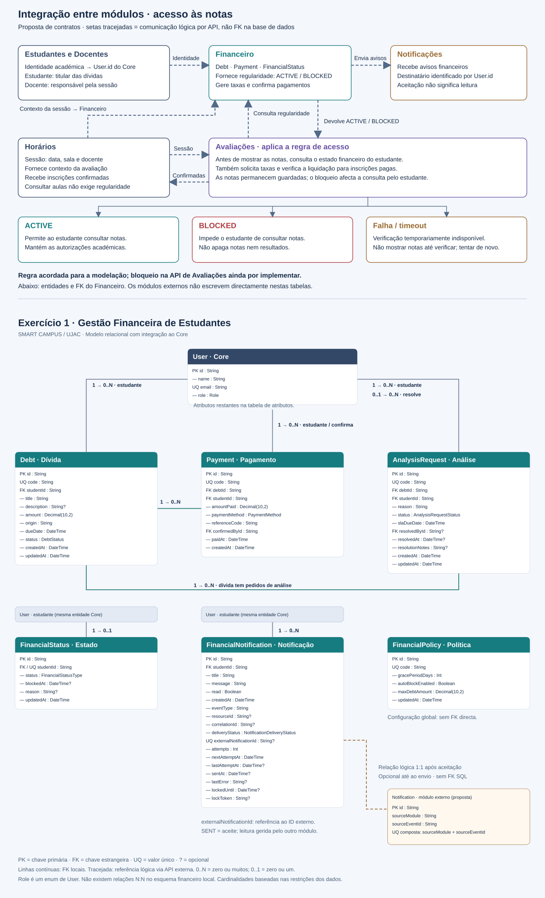
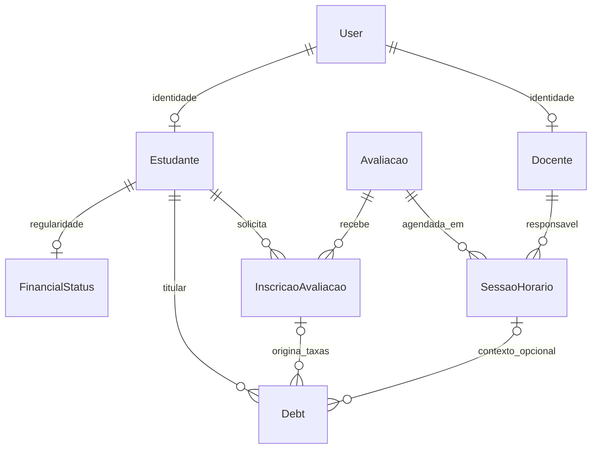

# Exercício 1 — Modelação de dados e relações

Módulo: Gestão Financeira de Estudantes — SMART CAMPUS / UJAC.



## Âmbito e notação

Modelo baseado em `apps/api/prisma/schema.prisma`. As FK locais apresentadas estão declaradas no Prisma e foram aplicadas à base de dados local pela migração `20260916000000_add_financial_user_relations`. `studentId` nas entidades financeiras referencia `User.id`, não o atributo opcional `User.studentId` (número de estudante). Os blocos repetidos de User no desenho representam a mesma entidade. A referência ao módulo externo de Notificações é lógica, por API, e não uma FK entre bases de dados.

PK = chave primária; FK = chave estrangeira; UQ = único. Obrigatório significa não nulo na base de dados, mesmo quando o valor é gerado automaticamente. Os tipos são os do Prisma; Decimal usa precisão 10 e escala 2.

## Relações

| Origem | Destino / campo | Tipo | Regra |
|---|---|---|---|
| User | Debt.studentId | 1:N | Um estudante tem zero ou muitas dívidas; cada dívida pertence a um estudante. |
| Debt | Payment.debtId | 1:N | Uma dívida tem zero ou muitos pagamentos; cada pagamento pertence a uma dívida. |
| Debt | AnalysisRequest.debtId | 1:N | Uma dívida tem zero ou muitos pedidos; cada pedido refere uma dívida. |
| User | Payment.studentId | 1:N | Um estudante tem zero ou muitos pagamentos. |
| User | Payment.confirmedById | 1:N | Um operador confirma zero ou muitos pagamentos; cada pagamento tem um confirmador. |
| User | AnalysisRequest.studentId | 1:N | Um estudante submete zero ou muitos pedidos. |
| User | AnalysisRequest.resolvedById | 1:N | Um operador resolve zero ou muitos pedidos; cada pedido tem zero ou um responsável pela resolução. |
| User | FinancialStatus.studentId | 1:1 | Um estudante tem zero ou um estado financeiro; cada estado pertence a um estudante. studentId é único. |
| User | FinancialNotification.studentId | 1:N | Um estudante recebe zero ou muitas notificações. |

`FinancialPolicy` guarda configuração global e não possui FK. Não existem relações N:N no esquema financeiro local. `Role` é um enum, não uma tabela; por isso não tem PK nem FK própria.

A relação Debt–Payment é 1:N no esquema (debtId não é único), mesmo que as regras da aplicação restrinjam novos pagamentos depois de regularizada a dívida. Os campos studentId de pagamentos e pedidos devem corresponder ao estudante da dívida; essa coerência não é garantida apenas por FK individuais.

## Tabelas de atributos

### User — Utilizador · Core

| Nome | Tipo | Obrigatório/opcional | Chave | Referência / valor automático |
|---|---|---|---|---|
| id | String | Obrigatório | PK | uuid() |
| name | String | Obrigatório | — | — |
| email | String | Obrigatório | UQ | — |
| passwordHash | String | Obrigatório | — | — |
| role | Role | Obrigatório | — | STUDENT |
| studentId | String | Opcional | — | — |
| department | String | Opcional | — | — |
| isActive | Boolean | Obrigatório | — | true |
| createdAt | DateTime | Obrigatório | — | now() |
| updatedAt | DateTime | Obrigatório | — | Actualizado automaticamente |

### Debt — Dívida

| Nome | Tipo | Obrigatório/opcional | Chave | Referência / valor automático |
|---|---|---|---|---|
| id | String | Obrigatório | PK | cuid() |
| code | String | Obrigatório | UQ | — |
| studentId | String | Obrigatório | FK | User.id |
| title | String | Obrigatório | — | — |
| description | String | Opcional | — | — |
| amount | Decimal(10,2) | Obrigatório | — | — |
| origin | String | Obrigatório | — | — |
| dueDate | DateTime | Obrigatório | — | — |
| status | DebtStatus | Obrigatório | — | PENDENTE |
| createdAt | DateTime | Obrigatório | — | now() |
| updatedAt | DateTime | Obrigatório | — | Actualizado automaticamente |

### Payment — Pagamento

| Nome | Tipo | Obrigatório/opcional | Chave | Referência / valor automático |
|---|---|---|---|---|
| id | String | Obrigatório | PK | cuid() |
| code | String | Obrigatório | UQ | — |
| debtId | String | Obrigatório | FK | Debt.id |
| studentId | String | Obrigatório | FK | User.id |
| amountPaid | Decimal(10,2) | Obrigatório | — | — |
| paymentMethod | PaymentMethod | Obrigatório | — | — |
| referenceCode | String | Obrigatório | — | — |
| confirmedById | String | Obrigatório | FK | User.id |
| paidAt | DateTime | Obrigatório | — | now() |
| createdAt | DateTime | Obrigatório | — | now() |

### AnalysisRequest — Pedido de análise

| Nome | Tipo | Obrigatório/opcional | Chave | Referência / valor automático |
|---|---|---|---|---|
| id | String | Obrigatório | PK | cuid() |
| code | String | Obrigatório | UQ | — |
| debtId | String | Obrigatório | FK | Debt.id |
| studentId | String | Obrigatório | FK | User.id |
| reason | String | Obrigatório | — | — |
| status | AnalysisRequestStatus | Obrigatório | — | PENDENTE_ANALISE |
| slaDueDate | DateTime | Obrigatório | — | — |
| resolvedById | String | Opcional | FK | User.id |
| resolvedAt | DateTime | Opcional | — | — |
| resolutionNotes | String | Opcional | — | — |
| createdAt | DateTime | Obrigatório | — | now() |
| updatedAt | DateTime | Obrigatório | — | Actualizado automaticamente |

### FinancialStatus — Estado financeiro

| Nome | Tipo | Obrigatório/opcional | Chave | Referência / valor automático |
|---|---|---|---|---|
| id | String | Obrigatório | PK | cuid() |
| studentId | String | Obrigatório | FK / UQ | User.id |
| status | FinancialStatusType | Obrigatório | — | ACTIVE |
| blockedAt | DateTime | Opcional | — | — |
| reason | String | Opcional | — | — |
| updatedAt | DateTime | Obrigatório | — | Actualizado automaticamente |

### FinancialNotification — Notificação financeira e envio externo

| Nome | Tipo | Obrigatório/opcional | Chave | Referência / valor automático |
|---|---|---|---|---|
| id | String | Obrigatório | PK | cuid() |
| studentId | String | Obrigatório | FK | User.id |
| title | String | Obrigatório | — | — |
| message | String | Obrigatório | — | — |
| read | Boolean | Obrigatório | — | false; leitura local, não sincronizada |
| createdAt | DateTime | Obrigatório | — | now() |
| eventType | String | Obrigatório | — | FINANCIAL_NOTICE por defeito; identifica o evento |
| resourceId | String | Opcional | — | ID do recurso de origem; referência lógica |
| correlationId | String | Opcional | — | Identificador da operação de origem |
| deliveryStatus | NotificationDeliveryStatus | Obrigatório | — | PENDING; registos anteriores à migração ficam LOCAL_ONLY |
| externalNotificationId | String | Opcional | UQ | Notification.id na API externa; referência lógica, não FK |
| attempts | Int | Obrigatório | — | 0; número de tentativas HTTP |
| nextAttemptAt | DateTime | Obrigatório | — | now(); agenda de envio |
| lastAttemptAt | DateTime | Opcional | — | Data da última tentativa |
| sentAt | DateTime | Opcional | — | Data de aceitação pela API externa |
| lastError | String | Opcional | — | Código resumido da última falha |
| lockedUntil | DateTime | Opcional | — | Fim da reserva temporária de envio |
| lockToken | String | Opcional | — | Identifica a tentativa que possui a reserva |

### FinancialPolicy — Política financeira

| Nome | Tipo | Obrigatório/opcional | Chave | Referência / valor automático |
|---|---|---|---|---|
| id | String | Obrigatório | PK | cuid() |
| code | String | Obrigatório | UQ | "DEFAULT_POLICY" |
| gracePeriodDays | Int | Obrigatório | — | 5 |
| autoBlockEnabled | Boolean | Obrigatório | — | true |
| maxDebtAmount | Decimal(10,2) | Obrigatório | — | 0.00 |
| updatedAt | DateTime | Obrigatório | — | Actualizado automaticamente |

## Domínios enumerados

- **Role:** STUDENT, TEACHER, TECHNICIAN, COORDINATOR, ADMIN, FINANCE.
- **DebtStatus:** PENDENTE, VENCIDA, REGULARIZADA, CANCELADA.
- **FinancialStatusType:** ACTIVE, BLOCKED.
- **AnalysisRequestStatus:** PENDENTE_ANALISE, PROCEDENTE, IMPROCEDENTE.
- **PaymentMethod:** BANK_TRANSFER, CASH_DEPOSIT, MOBILE_MONEY, POS.

## Integridade referencial

As sete relações financeiras com User usam `onDelete: Restrict` e `onUpdate: Cascade`: não é permitido apagar utilizadores referenciados por registos financeiros; uma alteração de ID propaga-se às referências. `resolvedById` continua opcional. As FK garantem existência do utilizador; os perfis continuam a ser controlados pela aplicação.

Verificação de referências inválidas (a partir de SMART CAMPUS):

```bash
node apps/api/prisma/scripts/check-financial-user-relations.cjs
```

## Relação com o módulo de Notificações (API separada)

`FinancialNotification.externalNotificationId` → `Notification.id`: relação lógica 1:1 para avisos financeiros aceites; zero ou uma correspondência enquanto o envio estiver pendente. O identificador externo é opcional e único. O bloco externo do desenho é uma proposta mínima de contrato, não uma tabela implementada nesta base de dados. O módulo receptor pode conter avisos de outros módulos.

`NotificationDeliveryStatus`: LOCAL_ONLY, PENDING, PROCESSING, SENT, FAILED. SENT significa aceite pela API externa; não significa lido pelo estudante.

Ver [contrato proposto e endpoints](../integracao-notificacoes.md). A migração `20260917000000_add_notification_delivery` acrescenta os campos de integração.


## Relações propostas com os módulos académicos

**Estado: proposta de integração para acordo entre grupos; não implementada no Prisma nem nas APIs.** O diagrama SVG acima apresenta as dependências entre módulos no painel superior e o modelo local existente no painel inferior. O diagrama seguinte acrescenta as relações conceptuais entre módulos; os nomes das entidades externas devem ser confirmados pelos respectivos grupos.

O Core gere a autenticação (`User`); Estudantes e Docentes gere os perfis académicos; Avaliações gere exames, inscrições e resultados; Horários gere sessões, datas, salas e docentes responsáveis. O Financeiro continua responsável pelas dívidas, pagamentos e regularidade financeira.

| Origem | Destino | Cardinalidade proposta | Ligação e finalidade |
|---|---|---|---|
| User | Estudante | 1:0..1 | `Estudante.userId` identifica a conta do Core; não confundir com número de matrícula. |
| User | Docente | 1:0..1 | `Docente.userId` identifica a conta do Core. O perfil docente não concede permissões de tesouraria. |
| Estudante | Debt | 1:0..N | Relação lógica via `Estudante.userId = Debt.studentId`; a FK local continua a apontar para User. |
| Estudante | FinancialStatus | 1:0..1 | Consulta da regularidade pelo ID do Core. |
| Estudante | InscricaoAvaliacao | 1:0..N | Avaliações regista a inscrição e consulta a regularidade financeira para inscrições e acesso do estudante às notas. |
| Avaliacao | InscricaoAvaliacao | 1:0..N | Cada inscrição corresponde a uma avaliação e a um estudante. |
| InscricaoAvaliacao | Debt | 1:0..N | Uma inscrição pode originar taxas distintas; cada dívida de avaliação identifica uma inscrição de origem. |
| Avaliacao | SessaoHorario | 1:0..N | Horários agenda sessões da avaliação. |
| Docente | SessaoHorario | 1:0..N | Cada sessão tem um docente responsável nesta proposta; co-docência exige rever a cardinalidade. |
| SessaoHorario | Debt | 1:0..N | Contexto opcional da taxa; uma dívida pode identificar zero ou uma sessão. Alterar a sessão não cria outra dívida. |

Estudante–Avaliação constitui uma relação N:N no domínio académico, resolvida por `InscricaoAvaliacao`, propriedade de Avaliações. Não é necessário copiar essa tabela para a base financeira.



As linhas entre módulos representam referências lógicas e contratos de consulta, não novas FK implementadas. Uma dívida de propina pode não ter inscrição nem sessão associada. A relação com Docente é indirecta, através da sessão de avaliação; salários e pagamentos a docentes estão fora do âmbito deste módulo.

### Atributos mínimos das entidades externas (propostos)

| Entidade / proprietário | Atributos | Chaves e regras |
|---|---|---|
| Estudante / Estudantes e Docentes | `id: string`, `userId: string`, `studentNumber: string`, `academicStatus: ACTIVE ou INACTIVE` | Todos obrigatórios; `id` é a PK externa, `userId` é único e referencia logicamente User.id. Estado académico é independente do financeiro. |
| Docente / Estudantes e Docentes | `id: string`, `userId: string`, `departmentId: string?` | `id` e `userId` obrigatórios; PK externa e referência única ao Core, respectivamente. |
| Avaliacao / Avaliações | `id: string`, `courseUnitId: string`, `type: string` | Todos obrigatórios; `id` é a PK externa; catálogo de tipos definido pelo grupo. |
| InscricaoAvaliacao / Avaliações | `id: string`, `assessmentId: string`, `studentUserId: string`, `status: PENDING ou CONFIRMED ou CANCELLED` | Todos obrigatórios; PK externa e referências à avaliação e ao Core. Unicidade proposta `(assessmentId, studentUserId)`. |
| SessaoHorario / Horários | `id: string`, `assessmentId: string`, `responsibleTeacherUserId: string`, `roomId: string`, `startsAt: DateTime`, `endsAt: DateTime`, `status: SCHEDULED ou CANCELLED` | Todos obrigatórios; PK externa e referências lógicas; `endsAt > startsAt`. Datas com fuso horário. |

### Atributos a acrescentar a Debt para rastrear a origem (propostos)

| Atributo | Tipo | Obrigatoriedade / regra |
|---|---|---|
| sourceModule | String? | Obrigatório para cobrança integrada; nesta proposta `assessments`. Nulo em dívidas locais anteriores. |
| sourceRequestId | String? | Identificador imutável do pedido de cobrança; único em conjunto com sourceModule. |
| externalRegistrationId | String? | Obrigatório em taxa de avaliação; ID de InscricaoAvaliacao. Referência lógica, não FK externa. |
| externalScheduleSessionId | String? | Opcional; ID de SessaoHorario quando a taxa está associada a uma sessão. |
| feeCode | String? | Obrigatório em cobrança integrada; código de taxa aprovado pelo Financeiro. |

`Debt.origin` já existe, mas é texto descritivo e não garante identificação nem deduplicação de uma cobrança externa. A implementação futura deve validar os campos em conjunto e garantir unicidade `(sourceModule, sourceRequestId)` e `(sourceModule, externalRegistrationId, feeCode)` para impedir cobranças repetidas da mesma taxa. Os grupos devem definir uma nova ocorrência de inscrição se o mesmo estudante repetir a avaliação e a taxa for novamente devida.

Os contratos, exemplos, permissões, tratamento de falhas e fluxo integrado estão em [Contratos Financial — referência central](../contratos-financial.md).


### Regra de acesso às notas — Avaliações → Financeiro

Regra acordada para a modelação, ainda por implementar na integração: antes de devolver notas ao estudante, a API de Avaliações consulta a regularidade no Financeiro pelo `User.id`.

| Resultado da consulta | Comportamento de Avaliações |
|---|---|
| ACTIVE | Permite consultar as próprias notas, respeitando as restantes autorizações académicas. |
| BLOCKED | Impede a consulta das notas pelo estudante; apresenta a necessidade de regularização financeira. |
| Falha, timeout ou resposta inválida | Não devolve notas; apresenta verificação temporariamente indisponível e permite nova tentativa, sem atribuir um estado financeiro. |

Avaliações aplica a restrição no servidor, incluindo listagens, detalhes e exportações de notas destinadas ao estudante. Ocultar apenas o botão no frontend não cumpre a regra. As notas continuam guardadas e a regra não bloqueia o lançamento de notas pelos docentes. Após regularização, uma nova consulta bem-sucedida com ACTIVE permite voltar a consultar as notas. Não guardar o estado indefinidamente na sessão do estudante.
