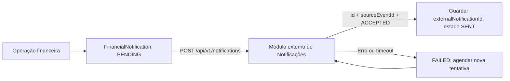

# Contrato proposto — Financeiro → Notificações

> A referência central para partilha e evolução dos contratos é [Contratos Financial](contratos-financial.md). Este documento conserva o detalhe anterior à consolidação.

**Estado: proposta para validação pelo grupo de Notificações.** O emissor financeiro está implementado; o receptor, a URL e a credencial de serviço dependem do outro grupo. Não foram enviados pedidos para uma API externa real.

## Responsabilidades e relação entre módulos

O Financeiro cria o aviso juntamente com a operação financeira, na mesma transacção. Após o commit, tenta enviá-lo por HTTP. O módulo de Notificações recebe, guarda e apresenta o aviso ao destinatário. A leitura pelo estudante é responsabilidade desse módulo.

`FinancialNotification.externalNotificationId` guarda o `Notification.id` devolvido pelo receptor. É uma **referência externa opcional e única**, não uma FK PostgreSQL, porque os módulos usam APIs/bases separadas. Para avisos financeiros aceites, a relação lógica é 1:1; antes da aceitação, um aviso local tem zero notificações externas associadas. O receptor pode também conter notificações de outros módulos.

O receptor deve guardar `sourceModule` e `sourceEventId` com unicidade composta. `sourceEventId` é sempre o ID local de `FinancialNotification`, permitindo repetir uma tentativa sem criar outro aviso. Os dois grupos devem utilizar o mesmo identificador de utilizador do Core: `recipientUserId = User.id`, não o número de matrícula.



## Endpoint a implementar pelo outro grupo

```http
POST /api/v1/notifications
Authorization: Bearer <credencial-de-servico>
Content-Type: application/json
Idempotency-Key: financial:<sourceEventId>
x-correlation-id: <identificador-da-operacao>
```

URL completa configurável no Financeiro. O token é uma credencial entre serviços fornecida pelo grupo receptor, com permissão para criar notificações de origem `financial`. Não é encaminhado o JWT do estudante. Usar HTTPS no ambiente partilhado e guardar a credencial apenas na configuração do servidor.

Corpo proposto:

```json
{
  "sourceModule": "financial",
  "sourceEventId": "cm_aviso_001",
  "recipientUserId": "usr_student_01",
  "eventType": "DEBT_CREATED",
  "resourceId": "cm_divida_001",
  "title": "Nova Divida Registada",
  "message": "Foi emitida uma nova divida no valor de 3500 MZN.",
  "channel": "IN_APP",
  "occurredAt": "2026-09-17T08:00:00.000Z"
}
```

| Campo | Tipo | Regra |
|---|---|---|
| sourceModule | string | Sempre `financial` |
| sourceEventId | string | ID imutável do aviso financeiro; chave de idempotência |
| recipientUserId | string | ID do utilizador do Core |
| eventType | string | Tipo de evento da tabela abaixo |
| resourceId | string ou null | ID da dívida, pagamento ou pedido; null em aviso genérico |
| title | string | Título do aviso |
| message | string | Conteúdo do aviso |
| channel | string | `IN_APP` nesta versão |
| occurredAt | string ISO 8601 | Data original; mantém-se nos reenvios |

| Evento | Quando é gerado | resourceId |
|---|---|---|
| DEBT_CREATED | Criação de dívida | Debt.id |
| PAYMENT_CONFIRMED | Confirmação de pagamento | Payment.id |
| ANALYSIS_REQUEST_RESOLVED | Resolução de contestação | AnalysisRequest.id |
| FINANCIAL_NOTICE | Aviso genérico criado no registo local | Pode ser null |

### Resposta obrigatória

`201 Created` para a primeira recepção; `200 OK` para uma repetição do mesmo evento:

```json
{
  "data": {
    "id": "notif_001",
    "sourceEventId": "cm_aviso_001",
    "status": "ACCEPTED"
  },
  "meta": {
    "correlationId": "identificador-da-operacao",
    "timestamp": "2026-09-17T08:00:01.000Z"
  }
}
```

O receptor só confirma depois de persistir o aviso. Em repetição, devolve o mesmo `id`, sem duplicar a notificação. Deve comparar o conteúdo de um evento repetido e rejeitar conteúdo diferente com `409 IDEMPOTENCY_CONFLICT`. A criação e a deduplicação devem ser atómicas no receptor.

O Financeiro valida `data.id`, `data.sourceEventId` e `data.status`. Uma resposta vazia, um evento diferente ou outro código HTTP é tratado como falha. **SENT significa aceite pelo módulo externo, não lido pelo estudante nem entregue por SMS/email.**

Erros propostos: `400` dados inválidos; `401` credencial inválida; `403` origem sem permissão; `404` destinatário inexistente; `409` conflito de idempotência; `429` limite de pedidos; `500/503` falha temporária. Usar envelope `{ code, message, correlationId }`. O corpo de erro externo não é guardado no Financeiro.

A definição legível por ferramentas está em [contrato-notificacoes.openapi.json](contrato-notificacoes.openapi.json).

## Endpoints implementados no Financeiro

Autenticação JWT do Core, perfis **FINANCE ou ADMIN**:

| Método | Endpoint | Finalidade |
|---|---|---|
| GET | `/api/v1/financial/notifications/:notificationId/delivery` | Consultar estado do envio |
| POST | `/api/v1/financial/notifications/:notificationId/retry` | Tentar novamente um aviso pendente/falhado; corpo `{}` |

Exemplo de resposta, dentro de `data`:

```json
{
  "id": "cm_aviso_001",
  "deliveryStatus": "SENT",
  "externalNotificationId": "notif_001",
  "attempts": 2,
  "lastAttemptAt": "2026-09-17T08:01:00.000Z",
  "nextAttemptAt": null,
  "sentAt": "2026-09-17T08:01:01.000Z",
  "lastError": null
}
```

O POST retorna `200` se aceite/já enviado ou se for um aviso histórico `LOCAL_ONLY`; `202` se continuar pendente, em processamento ou falhado (ver `data.deliveryStatus`); `503 NOTIFICATIONS_NOT_CONFIGURED` se faltar configuração para enviar. Retorna ainda `400`, `401`, `403` ou `404` conforme validação, autenticação, perfil e existência. Não permite alterar o destinatário, conteúdo ou URL. O pedido de nova tentativa é auditado. Avisos `SENT` e `LOCAL_ONLY` não são reenviados.

O endpoint existente `GET /api/v1/financial/students/:studentId/notifications` conserva o seu formato. O campo `read` mantém compatibilidade local e **não é sincronizado** com a leitura no módulo externo nesta versão.

## Entrega, recuperação e configuração

Estados: `LOCAL_ONLY` (histórico anterior à integração), `PENDING`, `PROCESSING`, `SENT` e `FAILED`.

- A operação financeira e o aviso são gravados atomicamente; não há HTTP dentro da transacção.
- Há uma tentativa imediata após commit, com timeout de 5 segundos por defeito. Uma falha externa não desfaz a dívida/pagamento/decisão.
- Enquanto o servidor API estiver activo, verifica a fila de 30 em 30 segundos, em lotes de até 10 avisos. O intervalo entre tentativas começa em 30 segundos, duplica e fica limitado a uma hora. Falhas de configuração/autorização no receptor também ficam visíveis em `lastError` e requerem correcção.
- Uma reserva por aviso evita envios concorrentes. Reservas abandonadas expiram após timeout + 60 segundos; o envio pode então ser retomado.
- A entrega é **pelo menos uma vez**. Em caso de confirmação perdida ou interrupção do processo, a idempotência no receptor impede duplicados.
- Sem URL/token válidos, novos avisos ficam `PENDING`, sem pedidos HTTP nem consumo de tentativas. Não há envio retroactivo automático dos avisos anteriores à migração.

Configurar na raiz do projecto e reiniciar a API após o acordo com o outro grupo:

```dotenv
NOTIFICATIONS_API_URL=https://host-do-grupo/api/v1/notifications
NOTIFICATIONS_API_TOKEN=credencial-fornecida-pelo-grupo
NOTIFICATIONS_TIMEOUT_MS=5000
NOTIFICATIONS_POLL_INTERVAL_MS=30000
```

Migração: `20260917000000_add_notification_delivery`. Acrescenta colunas e índices e preserva os registos antigos como `LOCAL_ONLY`. As FK existentes para User permanecem.

Antes da integração real, os grupos precisam de acordar URL, autenticação, IDs do Core, recepção idempotente e formato de confirmação. Os testes locais usam um receptor HTTP simulado; não comprovam o comportamento da API do outro grupo.
